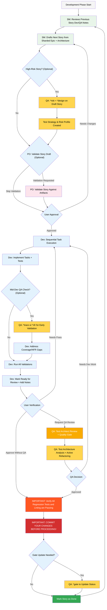

```mermaid
graph TD
    A["Development Phase Start"] --> B["SM: Reviews Previous Story Dev/QA Notes"]
    B --> B2["SM: Drafts Next Story from Sharded Epic + Architecture"]
    B2 --> S{"High-Risk Story? (Optional)"}
    S -->|Yes| T["QA: *risk + *design on Draft Story"]
    S -->|No| B3
    T --> U["Test Strategy & Risk Profile Created"]
    U --> B3{"PO: Validate Story Draft (Optional)"}
    B3 -->|Validation Requested| B4["PO: Validate Story Against Artifacts"]
    B3 -->|Skip Validation| C{"User Approval"}
    B4 --> C
    C -->|Approved| D["Dev: Sequential Task Execution"]
    C -->|Needs Changes| B2
    D --> E["Dev: Implement Tasks + Tests"]
    E --> V{"Mid-Dev QA Check? (Optional)"}
    V -->|Yes| W["QA: *trace or *nfr for Early Validation"]
    V -->|No| F
    W --> X["Dev: Address Coverage/NFR Gaps"]
    X --> F["Dev: Run All Validations"]
    F --> G["Dev: Mark Ready for Review + Add Notes"]
    G --> H{"User Verification"}
    H -->|Request QA Review| I["QA: Test Architect Review + Quality Gate"]
    H -->|Approve Without QA| M["IMPORTANT: Verify All Regression Tests and Linting are Passing"]
    I --> J["QA: Test Architecture Analysis + Active Refactoring"]
    J --> L{"QA Decision"}
    L -->|Needs Dev Work| D
    L -->|Approved| M
    H -->|Needs Fixes| D
    M --> N["IMPORTANT: COMMIT YOUR CHANGES BEFORE PROCEEDING!"]
    N --> Y{"Gate Update Needed?"}
    Y -->|Yes| Z["QA: *gate to Update Status"]
    Y -->|No| K
    Z --> K["Mark Story as Done"]
    K --> B

    style A fill:#f5f5f5,color:#000
    style B fill:#e8f5e9,color:#000
    style B2 fill:#e8f5e9,color:#000
    style S fill:#e3f2fd,color:#000
    style T fill:#ffd54f,color:#000
    style U fill:#ffd54f,color:#000
    style B3 fill:#e3f2fd,color:#000
    style B4 fill:#fce4ec,color:#000
    style C fill:#e3f2fd,color:#000
    style D fill:#e3f2fd,color:#000
    style E fill:#e3f2fd,color:#000
    style V fill:#e3f2fd,color:#000
    style W fill:#ffd54f,color:#000
    style X fill:#e3f2fd,color:#000
    style F fill:#e3f2fd,color:#000
    style G fill:#e3f2fd,color:#000
    style H fill:#e3f2fd,color:#000
    style I fill:#f9ab00,color:#fff
    style J fill:#ffd54f,color:#000
    style K fill:#34a853,color:#fff
    style L fill:#e3f2fd,color:#000
    style M fill:#ff5722,color:#fff
    style N fill:#d32f2f,color:#fff
    style Y fill:#e3f2fd,color:#000
    style Z fill:#ffd54f,color:#000
```