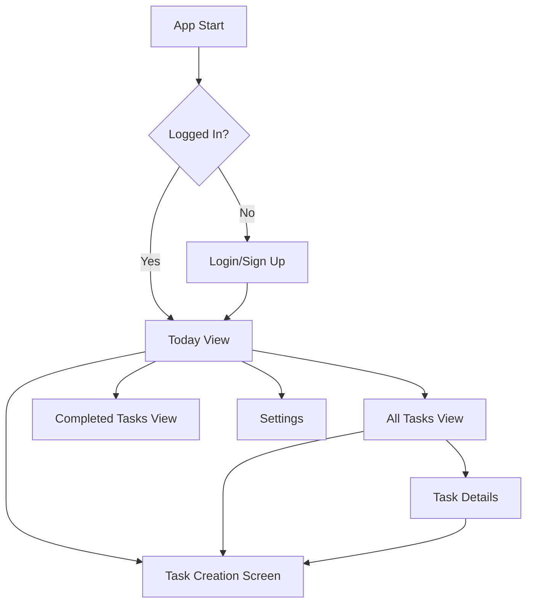
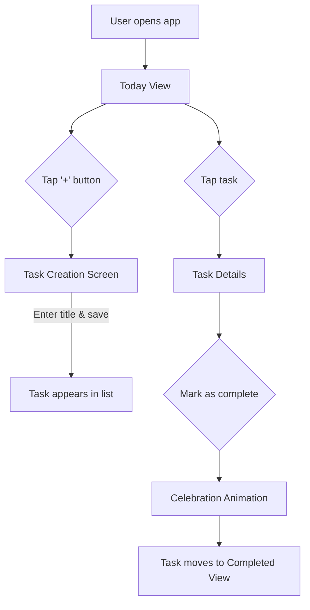

# To-Do Application for Students UI/UX Specification

## Introduction

This document defines the user experience goals, information architecture, user flows, and visual design specifications for the To-Do Application for Students's user interface. It serves as the foundation for visual design and frontend development, ensuring a cohesive and user-centered experience.

### Overall UX Goals & Principles

#### Target User Personas
- **The Overwhelmed Student:** Juggling academic, social, and work tasks. They need a simple, non-stressful way to manage their to-do list and feel a sense of progress.
- **The Procrastinator:** Easily demotivated by large task lists and missed deadlines. They need positive reinforcement and gentle encouragement to stay on track.

#### Usability Goals
- **Effortless & Intuitive:** New users can create and complete their first task in under 60 seconds.
- **Encouraging:** The application's feedback and tone make users feel good about their progress, even when they miss deadlines.
- **Delightful:** The experience is enjoyable and satisfying, turning task management from a chore into a rewarding activity.
- **Fast & Responsive:** Interactions are immediate, with minimal load times, ensuring the app feels quick and reliable.

#### Design Principles
1.  **Simplicity First:** Every feature and UI element must be essential and easy to understand. Avoid clutter and complexity.
2.  **Celebrate Progress:** Actively celebrate every completed task to build momentum and motivation.
3.  **Encourage, Don't Punish:** Frame overdue tasks and mistakes as opportunities, not failures.
4.  **Clarity and Focus:** The UI should guide the user to the most important action at any given moment.

### Change Log

| Date | Version | Description | Author |
| :--- | :--- | :--- | :--- |
| 2025-09-03 | 1.0 | Initial draft generated in YOLO mode. | Sally (UX Expert) |

## Information Architecture (IA)

#### Site Map / Screen Inventory

#### Navigation Structure
- **Primary Navigation:** A simple bottom tab bar will be used for primary navigation, providing access to the main views: "Today", "All Tasks", and "Completed".
- **Secondary Navigation:** Navigation to secondary screens like "Settings" will be handled via an icon in the header of the main views.
- **Breadcrumb Strategy:** Not applicable for this mobile-first, shallow-hierarchy application.

## User Flows

### Flow: Core Task Management (Create, Edit, Complete)

**User Goal:** To quickly manage the lifecycle of a task.

**Entry Points:**
- Tapping a floating action button on the "Today" or "All Tasks" view.
- Tapping an existing task to edit or complete it.

**Success Criteria:**
- A new task is successfully created and appears in the task list.
- A task can be marked as complete, triggering a celebration and moving it to the "Completed" view.

#### Flow Diagram

#### Edge Cases & Error Handling:
- **Error:** User tries to save a task with no title.
  - **Handling:** Show a simple, friendly inline message asking for a title.
- **Offline:** User tries to create a task while offline.
  - **Handling:** Create the task locally and sync it when the connection is restored.

## Wireframes & Mockups

**Primary Design Files:** Detailed wireframes and high-fidelity mockups will be created and maintained in Figma. [Link to Figma Project - Placeholder]

### Key Screen Layouts

- **Today View:**
  - **Purpose:** Provide a focused view of tasks due today.
  - **Key Elements:** Header with date, list of today's tasks, floating action button (+) for new tasks.
- **Task Creation Screen:**
  - **Purpose:** Allow users to add a new task quickly.
  - **Key Elements:** Single text input for the task title, "Save" button. Minimalist design to encourage quick entry.
- **Completed Tasks View:**
  - **Purpose:** Showcase user's accomplishments.
  - **Key Elements:** A visually rewarding list or grid of all completed tasks, perhaps with completion dates.

## Component Library / Design System

**Design System Approach:** A new, minimal design system will be created. It will prioritize simplicity and the brand's encouraging tone. It will be built from the ground up to ensure a unique and ownable aesthetic, while following platform (iOS/Android) best practices.

### Core Components
- **Task Item:** The core component for displaying a task. Will have states for incomplete, complete, and overdue.
- **Celebration Animation:** A Lottie-based animation that plays when a task is completed.
- **Encouragement Card:** A UI element for displaying encouraging messages for overdue tasks.
- **Buttons:** Primary and secondary buttons with a soft, friendly aesthetic.

## Branding & Style Guide

**Visual Identity:** The brand is modern, clean, friendly, and slightly playful. It should feel like a cool, supportive friend, not a corporate tool.

#### Color Palette

| Color Type | Hex Code | Usage |
| :--- | :--- | :--- |
| Primary | #4A90E2 | Main calls to action, interactive elements. |
| Secondary | #F5A623 | Secondary actions, highlights. |
| Accent | #7ED321 | Celebratory elements, success states. |
| Success | #7ED321 | Positive feedback, confirmations. |
| Warning | #F8E71C | Non-critical alerts, gentle reminders. |
| Error | #D0021B | Error messages (used sparingly). |
| Neutral | #4A4A4A, #9B9B9B, #F9F9F9 | Text, borders, backgrounds. |

#### Typography
- **Primary Font:** Inter (A clean, modern, and highly readable sans-serif).
- **Type Scale:**
  - H1: 32pt, Bold
  - H2: 24pt, Bold
  - Body: 16pt, Regular
  - Small: 12pt, Regular

#### Iconography
- **Icon Library:** Feather Icons (A clean, simple, and friendly set of open-source icons).

## Accessibility Requirements

**Compliance Target:** The application will adhere to **WCAG 2.1 Level AA** guidelines.

### Key Requirements
- **Visual:**
  - Color contrast ratios will meet or exceed 4.5:1 for normal text.
  - All interactive elements will have clear focus indicators.
- **Interaction:**
  - The app will be fully navigable and operable via keyboard and screen readers (VoiceOver, TalkBack).
  - Touch targets will be at least 44x44 points.
- **Content:**
  - All images and icons that convey information will have appropriate alternative text.

## Responsiveness Strategy

**Breakpoints:** As a mobile-only application, the primary focus is on phone-sized screens. The layout will be responsive to adapt fluidly from smaller phones to larger "phablets".
- **Mobile:** 320px - 480px
- **Tablet:** 481px - 1024px (Considered secondary, will adapt single-column layout gracefully).

**Adaptation Patterns:** The layout will be a flexible, single-column design that reflows content based on screen width.

## Animation & Micro-interactions

**Motion Principles:** Motion should be purposeful, delightful, and performant. It will be used to provide feedback, guide focus, and enhance the emotional connection to the app.

### Key Animations
- **Task Completion:** A satisfying and celebratory animation (e.g., confetti, star burst) when a task is checked off.
- **UI Transitions:** Smooth, subtle transitions between screens.

## Performance Considerations

**Performance Goals:**
- **Page Load:** App should be interactive in under 2 seconds.
- **Interaction Response:** Feedback for user actions should be under 100ms.

**Design Strategies:**
- Use optimized assets (e.g., compressed images, Lottie for animations).
- Implement virtualization for long lists of tasks.
- Keep animations simple and GPU-accelerated where possible.

## Next Steps

### Immediate Actions
1.  Review this specification with stakeholders (PM, Dev).
2.  Create high-fidelity mockups and prototypes in Figma.
3.  Prepare for handoff to the Architect for front-end architecture planning.

### Design Handoff Checklist
- [x] All user flows documented
- [x] Component inventory complete
- [x] Accessibility requirements defined
- [x] Responsive strategy clear
- [x] Brand guidelines incorporated
- [x] Performance goals established
